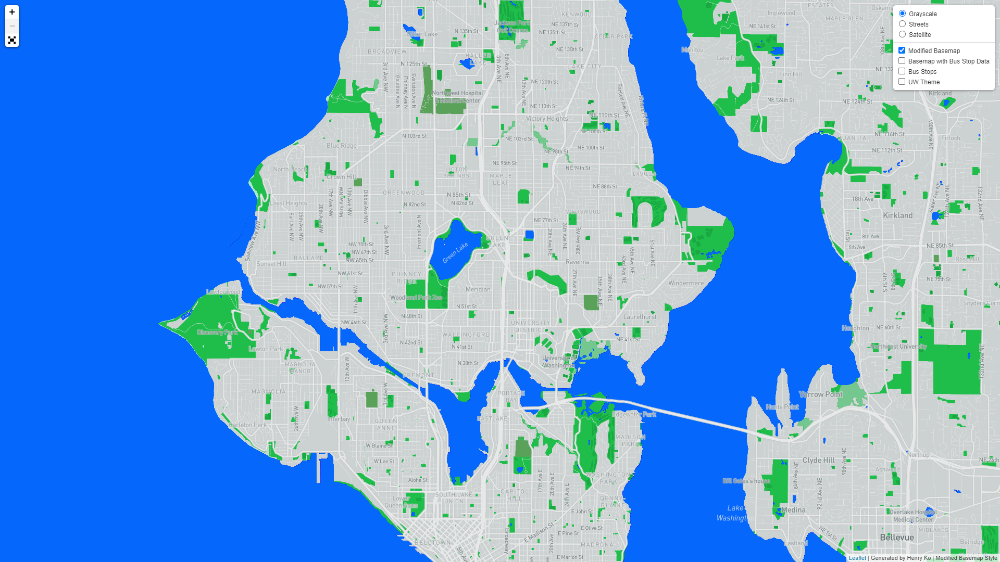
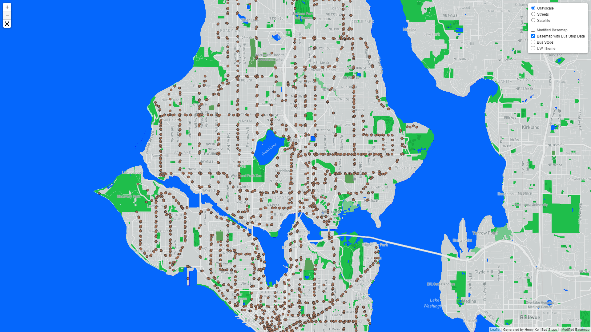
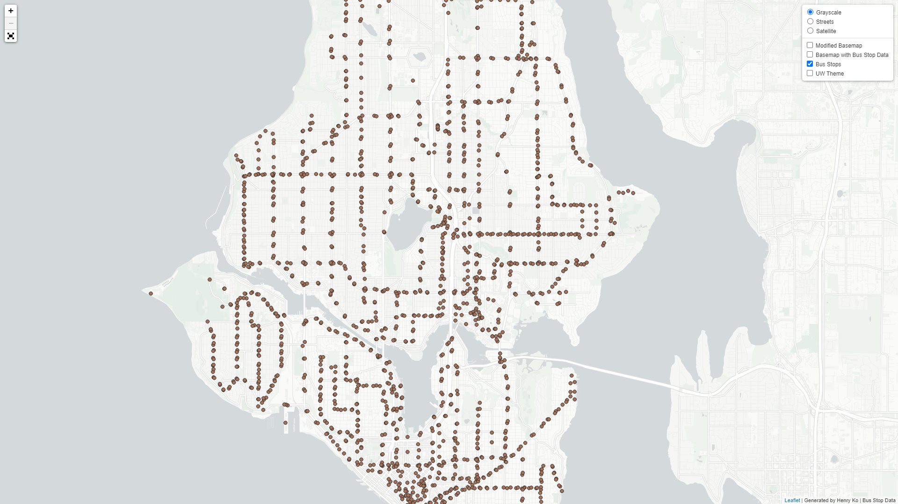
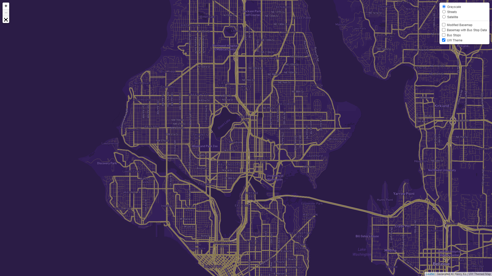

# TileMaps
Tile mapping project for Geog458
### Live URL:
https://kod3-1765277.github.io/TileMaps/

# Screenshots

## Basemap

## Basemap with Bus Stop Data

## Bus Stop Data Only

## Basemap with a UW Color Theme

# Description
This project aims to show the bus stops in the Seattle area, as well as
introducing various types of themes and basemaps to go along with it. The maps
available in this project, specifically, includes one modified monochrome map
from Mapbox, an alternate version of it with the bus stop points, one default
map with bus stops, and one modified with the [color scheme](https://www.washington.edu/brand/graphic-elements/primary-color-palette/) from the
University of Washington. The basemaps also have alternate fonts for
neighborhoods for thematic purposes - particularly to highlight parts of the
University. It was also nice to have more distinctions in general.
All tile sets have the same zoom levels of 13 to 16 (though, it should be noted
that the tiles were generated to suit levels 10 to 16 on QGIS). This was done
to ensure the map would load to a full screen worth of the custom basemaps.
The only other thing to note when it comes to the project is the use of a custom
Leaflet plugin for [fullscreen controls](https://brunob.github.io/leaflet.fullscreen/) provided by [Bruno B](https://github.com/brunob/).
Credit for the bus stop data goes to [MyGeoData Cloud](https://mygeodata.cloud/data/download/osm/bus-stops-and-stations/united-states-of-america--washington/king-county/seattle).
